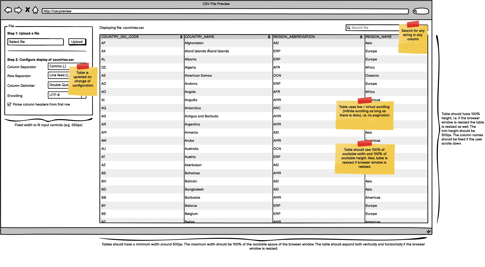

# Code Challenge: CSV Preview App

This repository contains a shell project as a starting point for the code challenge "CSV Preview App". The challenge is
described below.

## Challenge

* Write a Jakarta EE web application that is able to display the contents of a CSV file.
* The look and feel is outlined by a wireframe (see below).
* The behaviour of the application is also described below.
* Use the following technology stack
    * Java >= 11
    * Build tool: [Apache Maven](https://maven.apache.org.)
    * Container: [Payara Server](https://www.payara.fish)
    * Framework: [Jakarta EE](https://jakarta.ee) 8.0.0
    * Front End: [Jakarta Server Faces](https://jakarta.ee/specifications/faces/)
      with [PrimeFaces 8.0](https://www.primefaces.org)
    * Theme: provided default theme of PrimeFaces (saga)
    * Testing with [JUnit](https://junit.org/junit5/) and [Mockito](https://site.mockito.org)
* You may use third-party libraries if they are publicly licensed and free to use.
* Think of your code as production-ready code.
* You may start with this provided shell project to start the challenge.
* See a [sample CSV file with generated names](doc/names.csv) for testing (generated
  with [convertcsv.com](https://www.convertcsv.com/generate-test-data.htm))

## Wireframe

## Behaviour

### User Action 1: Start / first visit

* The controls of Step 2 in the left panel are disabled.
* The table, the search bar and the header are not displayed.
* It's only possible to select a file which should be uploaded (proceed with User Action 2).
* The upload starts by clicking the "Upload" button.

### User Action 2: Upload the first file

* As a first step, the user must upload a CSV file (file ending must be .csv).
* After the upload was successful the input controls of Step 2 in the left panel are enabled.
* Also, the application tries to display the data of the CSV file in the table by using the default settings (see below)
  .
* If the first row of the CSV file contains the column names (default settings) the column names should be displayed.
* If the file does not contain column names the columns should be named Column 1, Column2, Column 3, etc.
* If the data of the file cannot be parsed or displayed, an error message should be displayed in a small dialog.

### User Action 3: Change configuration

* The user is able to change the configuration in the left panel.
* After each change, the data in the table is updated, e.g. when the user changes the column separator from "comma" to "
  semicolon".

### User Action 4: Upload a new file

* If the user uploads a new file all configured settings in the left panel are kept.
* After the upload was successful and the contents of the file are readable the table is refreshed, i.e. the contents of
  the new file are displayed.
* If the upload fails or the contents of the file are not readable an error message should be displayed in a small
  dialog. Also, the old state of the application is kept so that the user can still browse the data of the previous
  file.

### User Action 5: Search

* When a file has been uploaded and the data table is displayed, the user can search the contents of the table by
  entering a search term in the search input field at the top right of the page.
* All columns are filtered by the entered search team.

### User Action 6: Sorting of columns

* Each column is sortable.

## Technical Remarks

### Data Table / Data Preview

* The Data Table should use the full width and height available.
* When the browser window is resized, the table should increase in both width and height.
* The columns of the data table should be sorted alphabetically by column name.
* Empty lines in a file can be ignored.
* The table should be scrollable without the use of pagination (virtual scrolling), i.e. when the user scrolls down new
  data is asynchronously fetched until the last row is reached.

### Application

* All updates to the page should be done without a page refresh, i.e. by AJAX based updates.
* A page refresh will reset the application and the user has to start with User Action 1.
* Only JSF / PrimeFaces default components should be used.
* The layout should be responsive by using PrimeFlex (FlexGrid CSS).

## Configuration Settings

* First row contains column header (Checkbox)
  * `true` (default)
  * `false`
* Column Separator
  * Comma (default)
  * Semicolon
  * Tabstop
* Row Separator
    * `LF` (Default) - Linefeed / corresponds to the ASCII character 0x0a (Unix)
    * `CR` - Corresponds to the ASCII character 0x0d (Macintosh)
    * `CRLF` - Corresponds to the ASCII character 0x0d ad 0x0a (Windows)
* Column Delimiter (optional / to delimit strings in a cell to avoid conflicts with the column separator, e.g. "Hello,
  World") / not applicable for numerical columns
    * Double Quotes, i.e. `"` (default)
    * Single Quotes, i.e. `'`
* Encoding
  * UTF-8 (default)
  * all available charsets of the system, see `Charset.availableCharsets()`